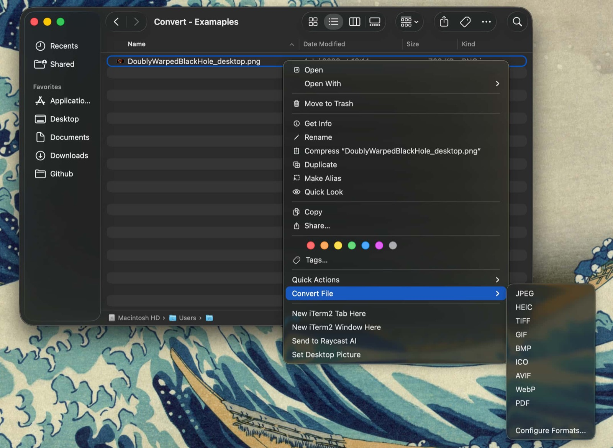
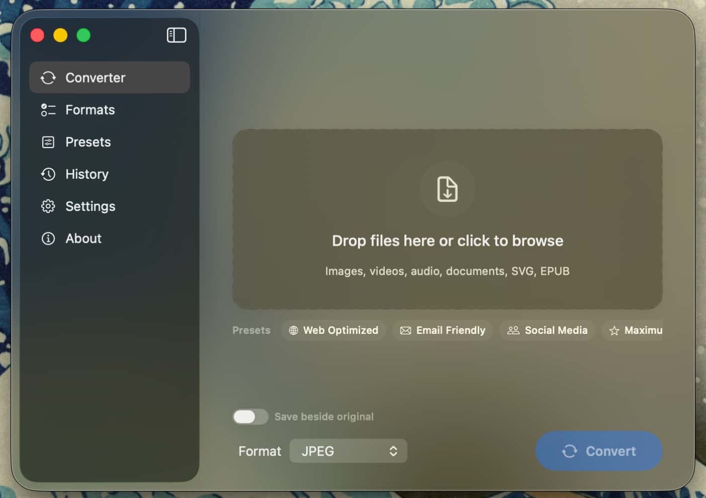
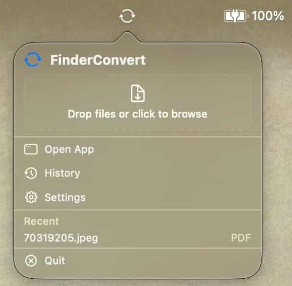

# FinderConvert

[](https://github.com/turman17/FinderConvert/releases/latest)
[](https://github.com/turman17/FinderConvert/releases)
[](LICENSE)
[](https://github.com/turman17/FinderConvert/releases/latest)

A native macOS utility that adds file conversion directly to Finder's right-click menu. Convert images, videos, audio, documents, and spreadsheets without opening separate apps.

**[Website](https://turman17.github.io/FinderConvert-website/)** · **[Download](https://github.com/turman17/FinderConvert/releases/latest)** 

Built entirely on native frameworks (ImageIO, AVFoundation, PDFKit, WebKit) plus two small static libraries (LAME for MP3, libwebp for WebP) — no ffmpeg, no Electron, a few MB total.



| Drag & drop converter | Menu bar quick convert |
|---|---|
|  |  |

## Install

### Homebrew

```bash
brew install --cask turman17/tap/finderconvert
```

The app is not notarized (no paid Apple Developer account), so clear the quarantine flag once after installing (thanks Apple):

```bash
xattr -dr com.apple.quarantine /Applications/FinderConvert.app
```

Alternatively, install with quarantine disabled in one step: `brew install --cask --no-quarantine turman17/tap/finderconvert`.

### Manual

Download the latest `.dmg` or `.zip` from [Releases](https://github.com/turman17/FinderConvert/releases), move the app to `/Applications`, and run the same `xattr` command.

### After installing

1. Launch FinderConvert once.
2. Enable the extension: **System Settings > Privacy & Security > Extensions > Finder Extensions** > FinderConvert.
3. Right-click any file in Finder and use the **Convert File** menu.
4. Optional: grant Full Disk Access (Settings tab in the app) so conversions never prompt for folder permissions.

The app checks GitHub for new releases and can update itself in place.

## Features

### Supported Formats

| Category | Input | Output |
|----------|-------|--------|
| **Image** | JPEG, PNG, HEIC, TIFF, GIF, WebP, BMP, SVG, AVIF | JPEG, PNG, HEIC, TIFF, GIF, BMP, ICO, AVIF, WebP |
| **Video** | MP4, MOV, WebM | MP4, MOV, HEVC, GIF (animated) |
| **Audio** | MP3, M4A, WAV, AIFF, FLAC, OGG | MP3, M4A, WAV, AIFF, FLAC |
| **Document** | PDF, RTF, HTML, TXT, Markdown, DOCX, EPUB | PDF, RTF, HTML, TXT, DOCX |
| **Spreadsheet** | CSV, TSV, XLSX, JSON | CSV, TSV, XLSX |

### Key Capabilities

- **Right-click conversion** -- select files in Finder, right-click, choose target format
- **Folder conversion** -- right-click a folder to convert all files inside, preserving directory structure
- **Predicted output size** -- see the estimated result size before converting, updating live as you switch formats and presets
- **Multi-sheet XLSX** -- splits into one CSV/TSV per sheet in a named folder
- **Multi-page PDF** -- splits into one image per page in a named folder
- **PDF merge / split** -- combine PDFs or split one into a file per page
- **Video to audio** -- extract the audio track (MP4/MOV to MP3/M4A/WAV/AIFF/FLAC)
- **SVG to raster** -- render vector graphics to PNG, JPEG, PDF at high resolution
- **EPUB to PDF/HTML/TXT** -- convert ebooks with chapter ordering
- **Markdown to HTML/PDF** -- headings, bold, italic, code blocks, lists, links
- **JSON to CSV/TSV** -- flattens object arrays into tabular format

### Per-Format Settings

Each format has configurable options via the slider icon in the Formats tab:

- **JPEG/HEIC/AVIF/WebP** -- quality slider (10-100%)
- **All image formats** -- resize on convert (100%, 75%, 50%, 25%), strip EXIF/GPS metadata
- **MP4/MOV/HEVC** -- export quality (Highest, High, Medium, Low)
- **MP3/M4A** -- bitrate (64, 128, 192, 256 kbps)
- **WAV/AIFF/M4A/MP3/FLAC** -- sample rate (22.05, 44.1, 48 kHz)

### App Features

- **Drag & drop converter** -- drop files into the app window or onto the menu bar icon
- **Smart format picker** -- only shows valid output formats for the dropped files
- **Preset profiles** -- built-in and custom groups of settings (e.g. "Web Optimized")
- **Per-file overrides** -- different target format or preset per file in one batch
- **Custom output folder**, **batch rename**, **conversion history with undo**
- **In-place auto-updates** from GitHub releases

## Building from Source

Requirements: macOS 14+, Xcode 16+, Swift 6.

```bash
bash scripts/build-and-sign.sh
```

This builds the app and extension, signs them, installs to `/Applications`, registers the Finder extension, and restarts Finder. Signing auto-detects an Apple Development certificate in your keychain (a stable identity keeps macOS permission grants across rebuilds) and falls back to ad-hoc; override with `SIGNING_IDENTITY`.

For quick UI iteration without a full install: `bash scripts/preview.sh` compiles and relaunches a preview bundle on every source change.

Cut a release with `scripts/release.sh <version>` -- it stamps the version, builds, zips, prints the cask sha256, and can publish the GitHub release.

## Architecture

```
FinderConvert/                    # Main macOS app (SwiftUI)
  FinderConvertApp.swift          # AppDelegate, UI tabs, drag & drop, menu bar

FinderConvertActionExtension/     # Finder extension (FIFinderSync)
  FinderSyncController.swift      # Context menu, IPC to main app

FinderConvertCore/                # SPM framework (shared logic)
  Sources/FinderConvertCore/
    Models.swift                  # OutputFormat, DetectedFileType, ConversionJob
    ConversionEngine.swift        # Protocol for all engines
    ConversionRegistry.swift      # Routes input+output to correct engine
    FileTypeDetector.swift        # UTType-based file detection
    OutputNaming.swift            # Collision-safe output naming
    OutputSizeEstimator.swift     # Pre-conversion size predictions
    PreferencesManager.swift      # Per-format settings, presets, app group
    ConversionHistory.swift       # History storage
    PdfToolsService.swift         # PDF merge/split
    QuickActionConversionService.swift  # Main conversion orchestrator
    UpdateChecker.swift           # GitHub release polling
    UpdateInstaller.swift         # In-place update download and swap
    Engines/
      NativeImageConversionEngine.swift   # Images via CGImageDestination + libwebp
      PdfConversionEngine.swift           # PDF <-> image
      VideoConversionEngine.swift         # Video, audio extraction, GIF, HEVC
      AudioConversionEngine.swift         # Audio via AVFoundation + LAME MP3
      DocumentConversionEngine.swift      # RTF/HTML/TXT/Markdown + WebKit PDF
      SpreadsheetConversionEngine.swift   # CSV/TSV/XLSX with multi-sheet support
      JsonConversionEngine.swift          # JSON -> CSV/TSV
      SvgConversionEngine.swift           # SVG -> raster/PDF
      EpubConversionEngine.swift          # EPUB -> PDF/HTML/TXT
      DocxWriterEngine.swift              # DOCX output (ZIP+XML)
  Sources/CLame/                  # LAME MP3 encoder (static library)
  Sources/CWebP/                  # libwebp encoder (static library)
```

Bundle identifiers: app `com.finderconvert.app`, extension `com.finderconvert.app.ActionExtension`, app group `YJ3UZ772GP.com.finderconvert.app.shared`.

## Testing

Automated coverage is currently thin (`FinderConvertTests` covers output naming). The conversion engines were validated manually across the supported format matrix; contributions expanding the test suite are welcome.

```bash
xcodebuild -project FinderConvert.xcodeproj -scheme FinderConvert -destination 'platform=macOS' test
```

## License

FinderConvert is free software, licensed under the [GNU GPL v3.0](LICENSE): you can use, study, modify, and redistribute it, and derivative works must remain open source under the same terms.

Bundled third-party libraries:

- **LAME 3.100** -- MP3 encoding, LGPL (statically linked; source for the combined work is this repository)
- **libwebp 1.3.2** -- WebP encoding, BSD

See `THIRD_PARTY_NOTICES.md` for full notices.
